# 增强 `Vue` 项目的智能感知

本文说的类型支持仅仅是 `VS Code` 的 `IntelliSense` 功能，并非静态类型语言的类型检查，所以对开发的效率提升不大，但是可以提高项目的可维护性，即所谓代码即文档 `CaaD`（`Code as a Documentation` -_-）。

## `VS Code` 的 `IntelliSense` 功能

使用过 `IDE` 与静态类型语言的同学可能很熟悉了，比如 `VS`/`C#` 的自动导入命名空间、`Code Refactor`（重命名属性/方法/类名等标识符，并自动修改所有的引用）、转到定义（转到声明、查找引用）甚至代码段提取（提取一段代码作为一个函数，并自动将依赖的变量作为参数输入）等各种强大的功能。

而 `JS` 是一个动态类型的语言，为了支持上述功能，`VS Code` 团队开发了一个插件，名为 `Visual Studio IntelliCode`，最早该插件是作为一个外部扩展，后来直接作为内部扩展，可以直接使用。

以下摘自官网描述：

> IntelliSense is a general term for a variety of code editing features including: code completion, parameter info, quick info, and member lists. IntelliSense features are sometimes called by other names such as "code completion", "content assist", and "code hinting."

蹩脚翻译如下：

> 智能感知是一系列编码特性的统称，包括自动补全、参数提示、快捷信息以及成员提示。……

**特别注意**：在成员提示被关闭的情况下可以使用快捷键 `Ctrl`+`Space` 重新打开成员提示（极大的可能与 `Windows` 系统默认的输入法切换键冲突导致失效，此时可以考虑更换快捷键），与 `Ctrl`+`Shift`+`Space` 打开参数提示。

## 配置 `jsconfig.json`

首先要说的是 `jsconfig.json` 文件。用 `vue` 脚手架生成的项目中，并无该文件，且一般情况下没有该文件也会有 `IntelliSense` 功能。

这里配置 `jsconfig.json` 的必要原因是：

1. 无该文件会导致项目内的 `.d.ts` 文件不一定被加载；
2. 对于 `Vue` 项目来说，导入时使用 `@` 是很常见的行为，但是这将会导致 `IntelliSense` 无法识别。

一个常见的 `jsconfig.json` 配置如下：

```json
{
  "compilerOptions": {
    "baseUrl": ".",
    "paths": {
      "@/*": [
        "src/*"
      ]
    }
  },
  "include": [
    "./src/**/*.d.ts",
    "./src/**/*.js",
    "./src/**/*.vue"
  ]
}
```

这个 `jsconfig.json` 包含了对导入时 `@` 的解析以及扫描项目 `src` 目录及其子目录下的 `.d.ts`、`.js`、`.vue` 文件，以建立类型、引用等相关信息（转到定义、查找引用以及自动导入的关键）。

配置完成后重新加载（`Ctrl`+`Shift`+`P` 输入 `Reload Window` 并回车）即可。此时输入 `import '@/'` 后会有路径提示（如果没有可能是还没有加载完成，耐心等待一会儿 -.-）。

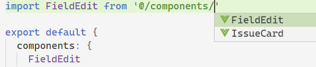

值得注意的是，导入 `SFC` 文件时，文件的路径必须添加 `.vue` 后缀：

```javascript
import FieldEdit from '@/components/FieldEdit.vue'
```

这样的话你就可以将光标移动到组件名称上按下 `F12` 键以导航到组件的定义，否则是无法导航到组件定义的，你会看到这样的提示：

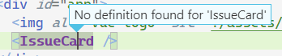

另外，配置完成后，还可以在 `<template>` 标签中得到自定义组件的补全提示，如果没有导入，甚至可以在敲回车补全时自动导入：

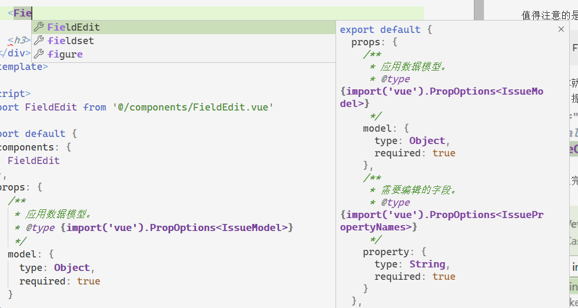

至于提示的组件的命名方式可以在此处配置，具体每个选项都有描述就不说了：

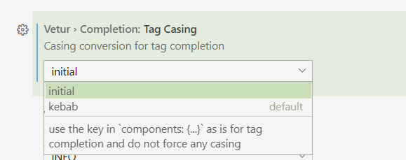

## `JSDoc` 注释

即使用注释来说明代码。在 `VS Code` 中可以通过在 `js` 类型的文件中输入 `/**` 来触发 `JSDoc` 代码片段，以下是一些实例：

```javascript
/**
 * 引用数据额外的信息发生了变化的事件。
 */
const EVENT_ISSUE_INFO_CHANGE = 'issue-info-change'

/**
 * 所属的应用类型 ID。
 */
const ISSUE_TYPE = {
  /** 需求。 */
  REQUIREMENT: 1,
  /** 任务。 */
  TASK: 2
}

/**
 * 将一个字符串反过来。
 * @param {string} str 需要反转的字符串。
 * @returns {string} 反转后的字符串。
 */
function reverseString (str) {
  return str.split('').reverse().join('')
}
```

这种注释可以提供如下的效果，在成员提示的列表中可以显示注释内容，即做到文档的效果（同时鼠标悬浮时也会有文档的提示）：

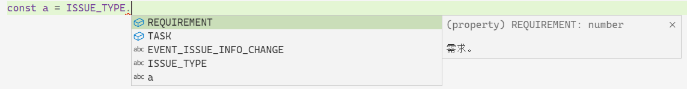

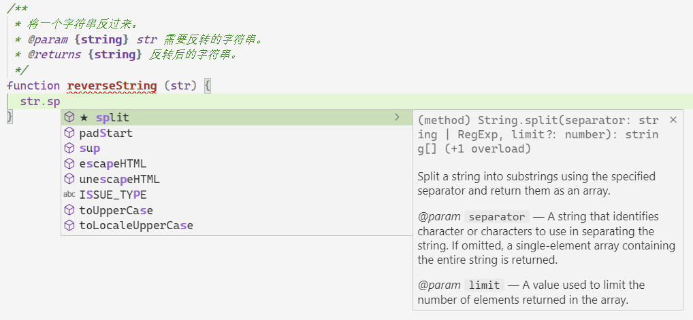

可以看到，第二张图标注了传入参数 `str` 的类型，在输入 `str.sp` 时会给予成员提示，敲回车键后即会自动完成。

## 类型声明文件

类型声明文件是一个 `.d.ts` 文件，使用过 `Type Script` 的同学应该不陌生，在使用 `Type Script` 开发库项目时，如果需要发布到 `npm` 仓库，则需要编译成 `js` 发布，并可以用 `tsc` 生成对应的类型声明文件，以供使用者参照。

对于没有 `Type Script` 的 `Vue` 项目，仍然可以使用 `.d.ts` 文件带来的部分便利，虽然需要手写 `.d.ts` 文件。

一个 `.d.ts` 文件的例子如下：

```typescript
/**
 * 应用数据的模型。
 */
declare type IssueModel = {
  /**
   * 应用数据的属性字典。
   */
  dataMap: {
    [key in IssuePropertyNames]: IssueProperty
  }

  /**
   * 可编辑的属性名称列表。
   */
  editablePropertyList: string[]
}

/**
 * 应用数据的数据属性名称列表。
 */
declare type IssuePropertyNames =
  'id' |
  'issuetype' |
  'key' |
  'project' |
  'summary' |
  'description'

/**
 * 应用数据的属性定义。
 */
declare interface IssueProperty {
  /**
   * 属性的名称。
   */
  name: string

  /**
   * 属性值的可读形式。
   */
  label: string

  /**
   * 属性值。
   */
  value: PropertyValue
}

/**
 * 属性值的类型。
 */
declare type PropertyValue = boolean | number | string | boolean[] | number[] | string[]
```

上述代码并不会生成 `js` 代码，仅仅在开发期间被编辑器或集成开发环境识别以用作代码自动完成、成员提示等功能。在数据结构较为复杂时，可以利用类型声明文件作为文档以提高项目的可维护性。

虽然类型声明文件不参与 `js` 代码的执行，但是仍然可以利用类型声明文件影响到 `js` 代码的编写，将上述类型声明文件保存后，即可在 `js` 代码中以 `JSDoc` 的形式引用：

```javascript
/**
 * 应用数据模型。
 * @type {IssueModel}
 */
const model = {
  dataMap: {
    issuetype: {
      value: ISSUE_TYPE.REQUIREMENT
    }
  }
}

console.log(model.dataMap.issuetype.value)
```

效果如下：

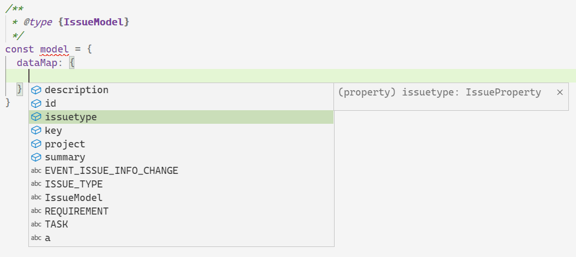

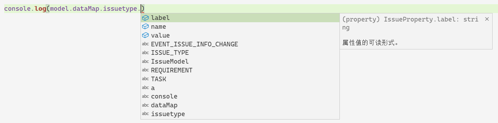

## `SFC` 的成员类型

```vue
<template>
  <div>
    <input v-model="value" @blur="handleInputBlur" />
  </div>
</template>

<script>
export default {
  props: {
    /**
     * 应用数据模型。
     * @type {import('vue').PropOptions<IssueModel>}
     */
    model: {
      type: Object,
      required: true
    },
    /**
     * 需要编辑的字段。
     * @type {import('vue').PropOptions<IssuePropertyNames>}
     */
    property: {
      type: String,
      required: true
    }
  },
  data () {
    return {
      value: this.model.dataMap[this.property].value,
      /**
       * @type {IssueModel}
       */
      other: {}
    }
  },
  methods: {
    /**
     * 获取属性值。
     * @param {IssueModel} issue 应用数据模型。
     * @param {IssuePropertyNames} property 属性名称。
     * @returns {PropertyValue} 属性值。
     */
    getPropertyValue (issue, property) {
      issue.dataMap[property].value
    },
    handleInputBlur () {
      this.$emit('submit', this.model, this.property, this.value)
    }
  }
}
</script>
```

上面分别标记了 `props`、`data`、`methods` 的数据类型、参数及返回值，在引用这些属性、变量时，将会有自动完成提示、参数信息等：

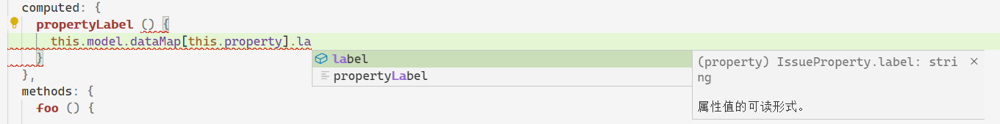

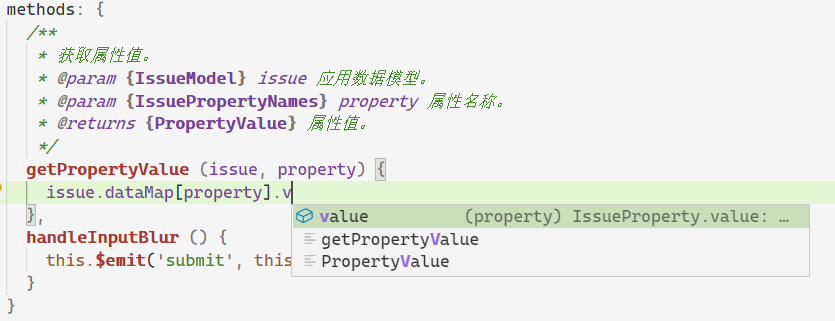

## 自动导入功能

在引用一些常用的导出符号时，如果这个符号没有被导入，则可以在打开的成员提示中找到这个标识符，并键入回车完成自动补全，这个时候会自动导入这个标识符：

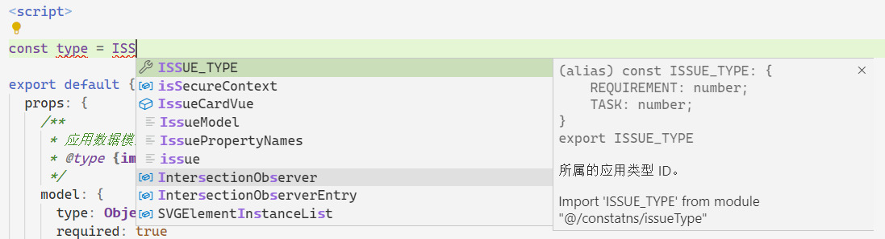

在提示信息中说明了 `Import 'ISSUE_TYPE' from module "@/constatns/issueType"`，键入回车即可自动导入该标识符。
