# 记一次内存泄漏的排查过程

`JavaScript` 是有垃圾回收机制的，一般不太需要考虑资源释放的问题。然而，即使有垃圾回收兜底，但是代码写的太过于奔放，仍然存在不小的问题。这篇文章就以 `********` 排查出的问题做个简单介绍（注：`********` 为内部项目名称，下同）。

## 检查是否存在内存泄漏

有用户反馈在 `********` 使用过程中，偶尔会出现浏览器崩溃的问题，然后在一次发版本的过程中，`****` 发现了内存占用达到了 `1GB` 程度，如下图（截图是后来截的，嫌麻烦就点到 `579MB`，多点几次总是能到 `1GB` 的 😏）：

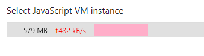

不过这 `579MB` 是正常内存占用，还是内存泄漏了呢？很简单，如果在使用过程中，内存占用未增加，或增加的都能在一段时间后（`GC` 执行了之后）正常释放掉，都是没有问题，但是如果在使用的过程中，内存一直增长而从未减少，即存在内存泄漏。

通过开发者工具里面的 `Memory` 面板，即可看到内存占用，使用 `Heap snapshot` 工具对内存占用做快照，在一顿猛烈的操作之前以及之后，分别做快照，然后对比一下就可以知道有没有内存泄漏了。

以 `********` 举例详细说下步骤：

1. 弄清楚你要排查哪一步可能存在内存泄漏，比如我需要排查 `A` 与 `B` 页面**来回切换时**，是否存在内存泄漏；
2. 先打开 `********` 的 B 页面**等待加载完毕**，因为如果你切换快了，可能也会造成内存泄漏（比方说，在接口返回后添加事件），这里要**一步步**排查，就是控制变量法）；
3. 然后**切换到 A 页面**，做快照之前要**先**把目标页面**加载一次**，因为“冷启动”也是要消耗资源的；
4. 再切换回 B 页面，在 `Memory` 面板中选择 `Heap snapshot` 然后点 `Take snapshot` 做初始的快照（做快照之前要点击一次 `GC` 按钮，参照下图）；
5. 点击 A 页面 => 点击 B 页面 => 点击 A 页面 => 点击 B 页面，反正就是一顿操作就是了，注意**手速**，**不要**把其他**不确定因素**引入进来；
6. 最后停留在做**初始内存快照**的页面，这里是 B 页面，然后再做一个内存快照（别忘了先点 `GC` 按钮）；
7. 对比一下两个数字就好了，如果没有太大差距的话，显然是没有内存泄漏的（当然，为了避免误判，你可以多重复几次第 `5` 步的操作），否则，存在内存泄漏。

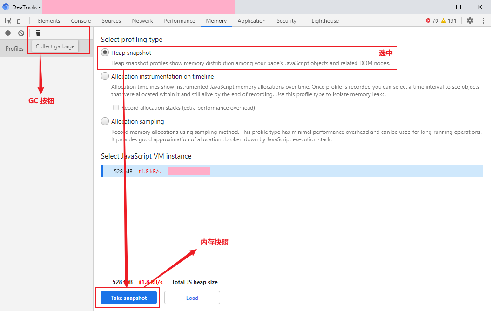

下面是 `********` 的（当然是点了很多很多次才会有这个数据的 🤣）：

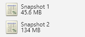

## 排查问题根源

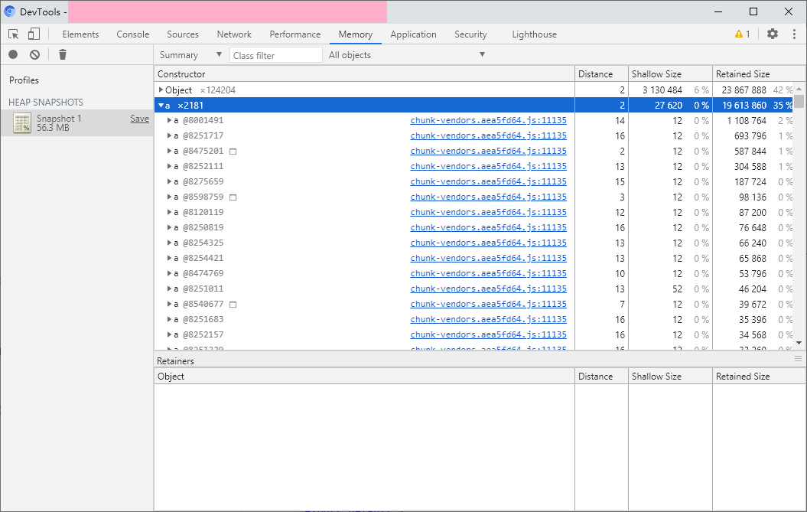

拿出上面步骤的第二个快照（图片里只有一个是因为我把第一个删了），展开 `a`（就是 `VueComponent`，经验），可以看到第一个 `a` 的“三围”：

- `Distance` 14 被引用的深度，表示由 `GC` 根（比如 `window` 对象、DOM 数根节点）到该对象之间最短的引用数量。
- `Shallow Size` 浅层大小，该对象本身的大小。
- `Reatined Size` 保留大小，表示如果当前对象被释放后，所有的从 `GC` 根无法达到的对象的总的大小，简单点说，释放了这个对象，能释放多少内存。

我们主要关注 `Distance` 和 `Reatined Size`，前者如果较大，我们可能就要关注一下这个对象是不是有问题。比如第一个 `a` 对象，鼠标悬浮 `a @8001491` 后，能看到该对象的数据：

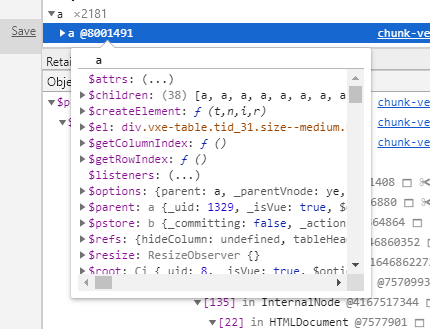

发现它是一个 `Vue` 组件的实例，鼠标悬浮到 `$el` 的值上面，如果这个元素仍然在页面上且是可见的，它就会像审查元素时一样覆盖一层蓝色矩形区域，显然这个没有（可以再展开其属性，看看 `isConnected`、`className`、`innerHTML` 了解具体是哪里的逻辑，以及是否从 `DOM` 树上移除了，这里的这个实例是一个表格组件）。而它的 `Retained Size` 则表示了，如果把这个对象给释放了，可以释放约 `1MB` 2% 的内存。

点击这个对象可以看到由该对象到 `GC` 根的引用关系：

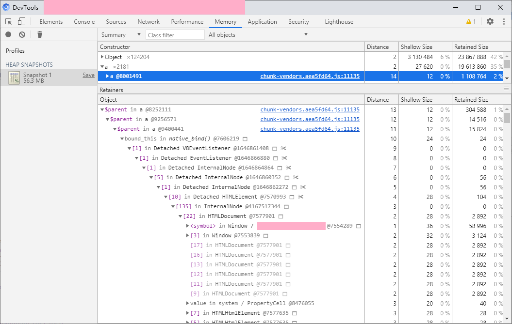

这张图说明：这个表格组件是另一个 `a`（`VueComponent`）组件的 `$parent` 属性，即作为另一个组件的父组件而被引用了，串联起来就是，这个表格组件被子组件引用了，子组件又被子组件引用了而子组件又被子组件引用了，而这个子组件又被一个方法引用了（这个方法使用 `bind` 绑定了这个组件），这个方法又被作为一个 `DOM` 元素的事件被引用了，而这个 `DOM` 元素又被 `InternalNode` 引用了，这个 `InternalNode` 属于 `HTMLDocument`。

即，这个表格里面有个组件添加了事件，但是组件销毁的时候没有把事件移除，所以，这个元素泄漏了，导致整个表格泄漏了。

将鼠标悬浮到 `bound_this in native_bind() @7606219` 上，可以看到：

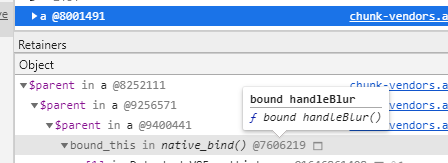

找到了这个被添加而没有被移除的事件叫 `handleBlur`。OK，你现在是不是想全局搜索 `handleBlur` 方法了？

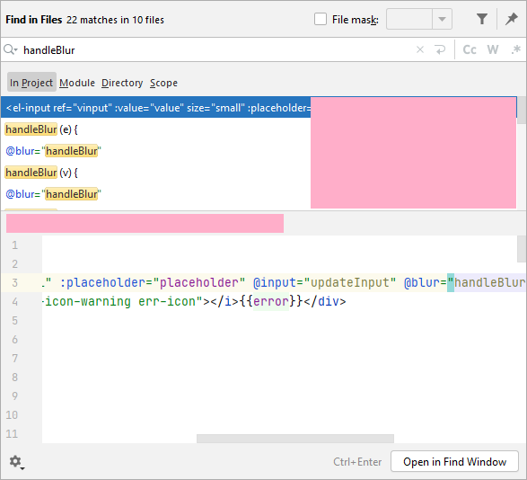

还真搜到了。。。不过，这样太麻烦了，可以看看这个 `bind` 绑定的到底是哪个组件，也就是鼠标悬浮这个上面的那一条记录 `$parent in a @9400441`，可以看到：

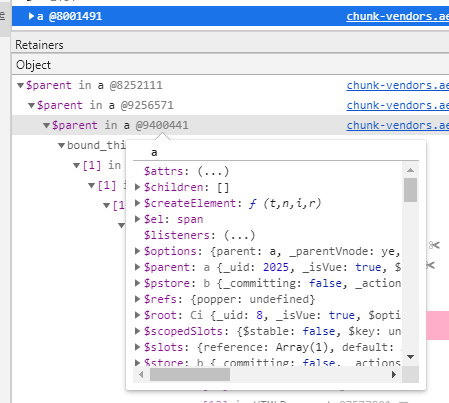

通过审查这个对象的 `$el` 可以知道，这是一个 `el-popover` 组件，也就是说 `el-popover` 监听了 `handleBlur` 事件，但是却没有移除，打开 `element` 仓库在 `packages\popover\src\main.vue` 中搜索 `handleBlur`：

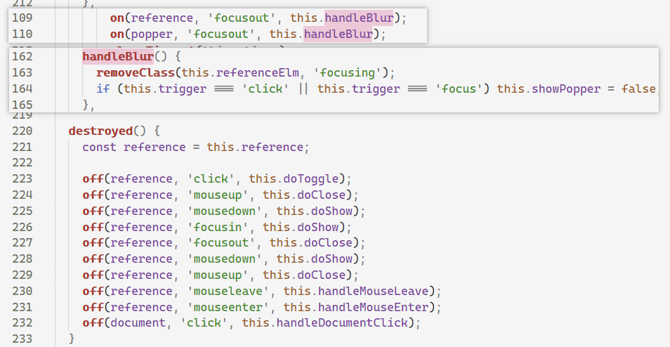

可以看到，只添加了该事件，而没有移除该事件。

## 修复内存泄漏问题

`Google` 搜索 `el-popover 内存泄漏`，然后复制、粘贴，`over`。不对，搜索结果第一条是：

> el-popover leaking memory · Issue #2561 · ElemeFE/element ...

2017 年的 `Issue`，点开一看，对应的 `PR` 已经合并了，而且是点击事件，不是 `focusout` 事件，难道是定位错了？其实用 `el-tooltip 内存泄漏`、`el-popover memory leak` 为关键字搜索是可以搜索到 [[Bug Report] Memory leak at el-tooltip cleanup](https://github.com/ElemeFE/element/issues/19370 "[Bug Report] Memory leak at el-tooltip cleanup")，提这个 `bug` 的仁兄还提了两个 `PR` 修复 `el-tooltip`，还有位仁兄也提了 `PR` 修复 `el-tooltip` 和 `el-popover`，然而。。。

为了修复这个问题，而不克隆 `element` 仓库，我们可以重写对应的方法，这里我拿 `el-tooltip` 举例，原版的 `el-tooltip` 的 `mounted` 代码如下：

```javascript
export default {
    // code ...

    mounted() {
        this.referenceElm = this.$el;
        if (this.$el.nodeType === 1) {
            this.$el.setAttribute('aria-describedby', this.tooltipId);
            this.$el.setAttribute('tabindex', this.tabindex);
            on(this.referenceElm, 'mouseenter', this.show);
            on(this.referenceElm, 'mouseleave', this.hide);
            on(this.referenceElm, 'focus', () => {
                if (!this.$slots.default || !this.$slots.default.length) {
                    this.handleFocus();
                    return;
                }
                const instance = this.$slots.default[0].componentInstance;
                if (instance && instance.focus) {
                    instance.focus();
                } else {
                    this.handleFocus();
                }
            });
            on(this.referenceElm, 'blur', this.handleBlur);
            on(this.referenceElm, 'click', this.removeFocusing);
        }
    },

    // code ...

    destroyed() {
        const reference = this.referenceElm;
        if (reference.nodeType === 1) {
            off(reference, 'mouseenter', this.show);
            off(reference, 'mouseleave', this.hide);
            // 这里移除了 handleBlur 方法，但是前面添加的不是这个方法。。。
            off(reference, 'focus', this.handleFocus);
            off(reference, 'blur', this.handleBlur);
            off(reference, 'click', this.removeFocusing);
        }
    }
}
```

通过如下方法重新实现它的相关方法：

```javascript
import { Tooltip } from 'element-ui'
import { on } from 'element-ui/lib/utils/dom'

Tooltip.methods.handleFocus = function () {
  if (!this.$slots.default || !this.$slots.default.length) {
    this.doFocus()
    return
  }
  const instance = this.$slots.default[0].componentInstance
  if (instance && instance.focus) {
    instance.focus()
  } else {
    this.doFocus()
  }
}

Tooltip.methods.doFocus = function () {
  this.focusing = true
  this.show()
}

Tooltip.mounted = function () {
  this.referenceElm = this.$el
  if (this.$el.nodeType === 1) {
    this.$el.setAttribute('aria-describedby', this.tooltipId)
    // 这行代码在 Element 上的提交日志是为了无障碍访问，这将导致测试提一些 bug（点击空白处关闭详情页后，文字的 tooltip 仍然显示）。
    // this.$el.setAttribute('tabindex', 0)
    on(this.referenceElm, 'mouseenter', this.show)
    on(this.referenceElm, 'mouseleave', this.hide)
    on(this.referenceElm, 'focus', this.handleFocus)
    on(this.referenceElm, 'blur', this.handleBlur)
    on(this.referenceElm, 'click', this.removeFocusing)
  }
}

export default {
  install () {

  }
}
```

即，将原来直接添加的事件，写成 `handleFocus` 方法（原来也有这个方法，故把原来的 `handleFocus` 方法改为 `doFocus` 方法，然后在 `handleFocus` 方法里调用，这样其 `destroyed` 里面释放的事件就是添加的事件了。

## 其他问题

通过同样的方式，还可以找到定时器未释放、点击事件未释放之类的问题，但都是项目内的代码，比较好解决就不展开了。

## 成果

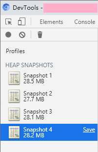

## 深入思考

不知道大家有没有注意，搜索中文的 `el-popover` 内存泄漏没有搜索到想要的结果，其实不移除事件一般也是可以的，而且不会造成内存泄漏，所以一般情况下比较难以发现这个问题。

现代浏览器都是用 `标记`-`清除` 算法或基于其改进的算法来实现的垃圾回收。其原理是从 `GC` 根开始，遍历所有引用的对象，并将其标记，当算法遍历完所有对象后，那些未被标记的对象将会被清除。

而 `Vue.js` 会在组件被销毁的时候，释放其引用，那么其引用的元素，以及元素引用的事件都将成为无根浮萍，会被 `GC` 回收。

再次审查上文中的表格组件，可以发现 `V8EventListener` 被 `Detached HTMLElement` 引用，而 `Detached HTMLElement` 又被 `InternalNode` 引用，这个 `InternalNode` 才是它没有被释放的真正原因。

至于这个 `InternalNode` 究竟是什么，我们 `N` 期之后再说（`N → ∞`）。

## 参考资料

- [内存术语](https://developers.google.com/web/tools/chrome-devtools/memory-problems/memory-101?hl=zh-cn "内存术语")
- [如何记录堆快照](https://developers.google.com/web/tools/chrome-devtools/memory-problems/heap-snapshots?hl=zh-cn "如何记录堆快照")
- [[Bug Report] Memory leak at el-tooltip cleanup](https://github.com/ElemeFE/element/issues/19370 "[Bug Report] Memory leak at el-tooltip cleanup")
- [内存管理](https://developer.mozilla.org/zh-CN/docs/Web/JavaScript/Memory_Management "内存管理")
