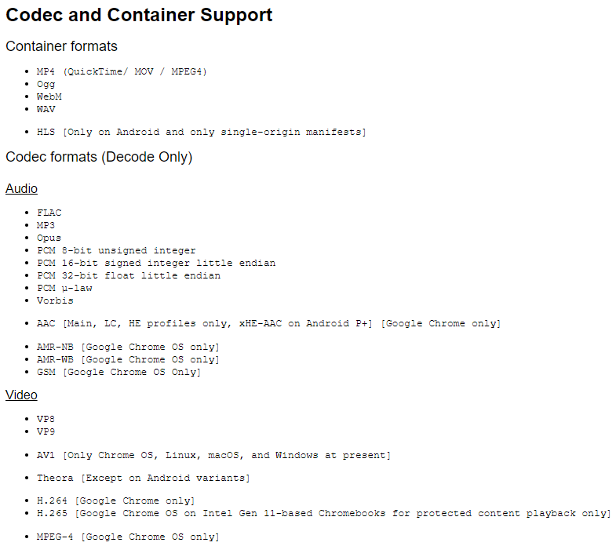
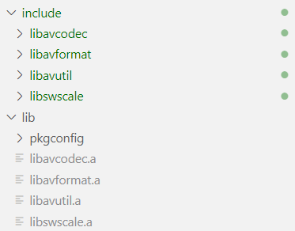

# 前端通过 ffmpeg 库播放视频

仓库地址：<https://github.com/hamflx/ffmpeg-fe>

先看一下 `chrome` 支持的视频格式与解码器：



其中 `H.265` 并不在一般的 `Chrome` 上支持，有时候我们需要播放一些不常用的格式，那么我们就可以将 `ffmpeg` 库编译为 `WebAssembly` 以支持这些格式。

`ffmpeg` 是一个音视频处理的通用库，我们需要用 `C++` 写一个调用 `ffmpeg` 的解码程序，该程序与 `JS` 进行通信，取得视频数据，并调用 `ffmpeg` 解码，将解码后的程序送给 `JS`，由 `JS` 调用 `WebGL` 渲染。


我这里以流的形式来取视频数据、解码，在播放器一侧在 `requestAnimationFrame` 中拉取视频数据：


## 构建 `ffmpeg` 库

首先需要把 `ffmpeg` 编译成几个库，后续我们的 `C++` 解码程序就可以调用这个库里的方法，构建命令：

```shell
CPPFLAGS="-D_POSIX_C_SOURCE=200112 -D_XOPEN_SOURCE=600" \
emconfigure ./configure \
    --prefix=$(pwd)/lib \
    --cc="emcc" \
    --cxx="em++" \
    --ar="emar" \
    --ranlib="emranlib" \
    --target-os=none \
    --enable-cross-compile \
    --enable-lto \
    --cpu=generic \
    --arch=x86_64 \
    --disable-asm \
    --disable-inline-asm \
    --disable-programs \
    --disable-avdevice \
    --disable-doc \
    --disable-swresample \
    --disable-postproc  \
    --disable-avfilter \
    --disable-pthreads \
    --disable-w32threads \
    --disable-os2threads \
    --disable-network \
    --disable-logging \
    --disable-everything \
    --enable-gpl \
    --enable-version3 \
    --enable-static \
    --enable-demuxers \
    --enable-parsers \
    --enable-decoder=pcm_mulaw \
    --enable-decoder=pcm_alaw \
    --enable-decoder=adpcm_ima_smjpeg \
    --enable-protocol=file \
    --enable-protocol=pipe \
    --enable-decoder=h264 \
    --enable-decoder=hevc

make && make install
```

以上构建命令成功后，将会得到下面的文件：



## 编写解码程序

通过 `ffmpeg` 的自定义流，来实现一个 `read_packet` 方法，该方法内部调用 `js` 的异步方法取得视频流，以此作为输入。程序主循环中不断尝试调用 `avcodec_receive_frame` 解码，当数据不足时，通过 `av_read_frame` 和 `avcodec_send_packet` 将数据发送给 `ffmpeg` 的解码器。

自定义输入流如下：

```cpp
int nBufferSize = 32768;
unsigned char *pReadBuffer = (unsigned char*)av_malloc(nBufferSize);
if (pReadBuffer == NULL)
{
  return DECODER_ERROR::AV_ERROR;
}

AVIOContext *pIoCtx = avio_alloc_context(pReadBuffer, nBufferSize, 0, (void*)this, DecoderReadPacket, NULL, NULL);
if (pIoCtx == NULL)
{
  return DECODER_ERROR::AV_ERROR;
}

m_pFmtCtx = avformat_alloc_context();
m_pFmtCtx->pb = pIoCtx;
m_pFmtCtx->flags = AVFMT_FLAG_CUSTOM_IO;

int ret;
while ((ret = avformat_open_input(&m_pFmtCtx, NULL, NULL, NULL)) == AVERROR(EAGAIN))
{
}
if (ret)
{
  return DECODER_ERROR::AV_ERROR;
}

int Decoder::ReadPacket(void *opaque, uint8_t*buf, int buf_size)
{
  emscripten::val packet = m_jsUpstream.call<emscripten::val>("next", buf_size).await();
  emscripten::val data = packet["data"];
  emscripten::val done = packet["done"];
  if (done.as<bool>())
  {
    return 0;
  }

  const auto nPacketLength = data["length"].as<unsigned>();
  if (nPacketLength > buf_size)
  {
    printf("==> nPacketLength > buf_size\n");
  }

  emscripten::val memoryView{emscripten::typed_memory_view(nPacketLength, buf)};
  memoryView.call<void>("set", data.call<emscripten::val>("slice", 0, nPacketLength));

  return nPacketLength;
}
```

程序主循环解码（其实是在 `JS` 里调用 `Next` 到 `C++` 的）如下：

```cpp
while ((ret = avcodec_receive_frame(m_pCodecCtx, m_pFrame)) == AVERROR(EAGAIN))
{
  while (1)
  {
    ret = av_read_frame(m_pFmtCtx, m_pPacketFrame);
    if (ret == 0)
    {
      if (m_pPacketFrame->stream_index == m_iVideoStream)
      {
        break;
      }
      av_packet_unref(m_pPacketFrame);
      continue;
    }

    printf("==> av_read_frame error: %s\n", av_err2str(ret));
    av_packet_unref(m_pPacketFrame);

    if (ret == AVERROR_EOF)
    {
      result.set("status", (int)DECODER_ERROR::END_OF_FILE);
      return result;
    }
    if (ret != 0)
    {
      printf("av_read_frame failed: %s\n", av_err2str(ret));
      result.set("status", (int)DECODER_ERROR::AV_READ_FRAME);
      return result;
    }
  }

  ret = avcodec_send_packet(m_pCodecCtx, m_pPacketFrame);
  av_packet_unref(m_pPacketFrame);

  if (ret != 0)
  {
    printf("==> avcodec_send_packet error: %s\n", av_err2str(ret));
    result.set("status", (int)DECODER_ERROR::AVCODEC_SEND_PACKET);
    return result;
  }
}
```

Makefile

```makefile
all: ../web/ff.js

rebuild: clean all

CC = emcc
CFLAGS = -O3 -I../lib/include
LIBOBJS := ../lib/lib/libavcodec.a ../lib/lib/libavutil.a ../lib/lib/libavformat.a
EMCCFLAGS = -gsource-map -g --bind -s ASYNCIFY -s WASM=1 -s ALLOW_TABLE_GROWTH=1 -s ALLOW_MEMORY_GROWTH=1 -s FILESYSTEM=0 -s ASSERTIONS=1

../web/ff.js: ff.cpp $(LIBOBJS)
 $(CC) $(EMCCFLAGS) $(CFLAGS) -o $@ $^

fflib: build-ffmpeg.sh
 sh build-ffmpeg.sh

clean:
 rm -f ff.js ff.wasm
```

## `web` 端

首先要实现一个视频来源对象，主要逻辑就是在调用 `next` 方法时，将视频数据返回，同时，如果数据太多，就先缓存着：

```js
async function beginReadPacket() {
  let cachedSize = 0
  /**

* @type {Uint8Array[]}
   */
  const cachedChunks = []
  const reader = (await fetch('test.mkv')).body.getReader()
  const combineChunks = size => {
    let resultSize = 0
    const result = new Uint8Array(size)
    while (resultSize < size) {
      const chunk = cachedChunks.shift()
      if (chunk.length + resultSize > size) {
        const needSize = size - resultSize
        result.set(chunk.slice(0, needSize), resultSize)
        resultSize += needSize
        cachedChunks.unshift(chunk.slice(needSize))
        break
      } else {
        result.set(chunk, resultSize)
        resultSize += chunk.length
      }
    }
    cachedSize -= result.length
    return result
  }
  return async size => {
    while (cachedSize < size) {
      const { done, value } = await reader.read()
      if (done) {
        if (!cachedSize) return { done }
        return { data: combineChunks(cachedSize) }
      }
      cachedChunks.push(value)
      cachedSize += value.length
    }
    return { data: combineChunks(size) }
  }
}
```

然后就是在 `requestAnimationFrame` 中调用 `decoder.next` 来拉去视频帧了，就不写了。当然，最后还有一步是拿解码后的 `YUV` 数据丢给 `WebGL` 渲染，具体就不展开了。

## 问题

虽然最开始是因为 `H.265` 无法播放，才去做这个东西的，但是吧，做完之后发现，就这样还真不一定能播放 `mp4` 封装的 `H.265` 视频。

对于 `mp4` 格式的文件信息 `moov` `box` 有可能是在文件最后的，我这里实现的方法是取视频流，一部分一部分的解码，就会导致取不到视频信息。所以对于这种视频文件，要么是把视频数据取完整了，一股脑塞进 `ffmpeg` 取识别，或者也可以把他的 `moov` `box` 放到前面，或者直接指定解码器参数也可以吧。

下面的命令将 `mp4` 视频的 `moov` `box` 放前面：

```shell
ffmpeg -i test.mkv -c:v libx265 -preset ultrafast -c:a copy -movflags faststart test.mp4
```

## 参考资料

- [C/C++ 面向 WebAssembly 编程](https://github.com/3dgen/cppwasm-book)
- [avformat_open_input fails only with a custom IO context](https://stackoverflow.com/questions/41734219/avformat-open-input-fails-only-with-a-custom-io-context)
- [avformat_open_input 返回 -1094995529“Invalid data found when processing input“](https://blog.csdn.net/wowotou_heihei/article/details/115622917)
- [FFmpeg 内存 IO 模式 (内存区作输入或输出)](https://www.cnblogs.com/leisure_chn/p/10318145.html)
- [ffmpeg 的编程教程](https://github.com/lightfish-zhang/mpegUtil)
- [一步步进行 ffmpeg 的 C 语言音视频编程](https://segmentfault.com/a/1190000017980746)
- [ffmpeg AVIOContext 自定义 IO 及 seek](https://segmentfault.com/a/1190000021378256)
- [FFmpeg 进行音频的解码和播放](https://cloud.tencent.com/developer/article/1669163)
