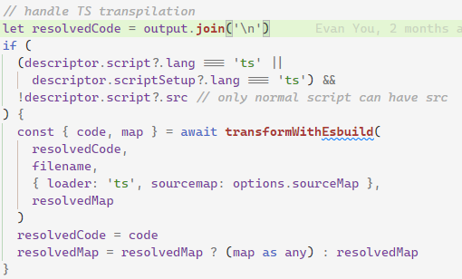
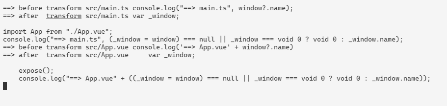

# vite 兼容性踩坑记录

vite 提供的快速启动开发模式服务器的特性非常好用，不过，有时候线上出了兼容性问题，你还无法快速定位到问题的根源，那就需要低版本的浏览器来进行开发测试，然而……

想要在低版本浏览器上运行项目，首先要在浏览器上打开项目，因为我们项目采用了可选链，导致连项目都打不开。

尝试配置 `config.esbuild.target` 为 `es2015`，ts 文件是可以被正确编译了，但是 vue 文件仍然不行，然后我去搜索，发现了好多人都有这个问题，但是貌似没有一个能给出很方便的解决方案的。在 GitHub 上有个 issue 给出了 PR，但是这个 PR 没有被合并（issue：[https://github.com/vitejs/vite/issues/5222](https://github.com/vitejs/vite/issues/5222 "https://github.com/vitejs/vite/issues/5222")，pr：[https://github.com/vitejs/vite/pull/5652](https://github.com/vitejs/vite/pull/5652 "https://github.com/vitejs/vite/pull/5652")）。

根据上面的 pr 我们可以看到 `plugin-vue` 的源代码，发现 vue 中的 ts 是不检查 `config.esbuild.target` 选项的，如下图：



所以我首先尝试的方法就是按照 PR 所述直接修改 node\_modules 里的文件，改完之后发现 vue 中的可选链被编译了，但是 ts 中的可选链仍然没有被编译，这个时候再搭配一下 `config.esbuild.target` 就能把两边问题都给解决了，不过这个方法要修改 node\_modules 不太好。

后来换了 `@rollup/plugin-babel` 插件，配置完也不行，研究了下源代码，对于 ts 项目，需要配置 extensions 才行：

```javascript
export const DEFAULT_EXTENSIONS: ['.js', '.jsx', '.es6', '.es', '.mjs'];

const unpackOptions = ({
  extensions = babel.DEFAULT_EXTENSIONS,
  // rollup uses sourcemap, babel uses sourceMaps
  // just normalize them here so people don't have to worry about it
  sourcemap = true,
  sourcemaps = true,
  sourceMap = true,
  sourceMaps = true,
  ...rest
} = {}) => {
  return {
    extensions,
    plugins: [],
    sourceMaps: sourcemap && sourcemaps && sourceMap && sourceMaps,
    ...rest,
    caller: {
      name: '@rollup/plugin-babel',
      ...rest.caller
    }
  };
};
```

配置如下：

```javascript
import { resolve } from 'path'
import { defineConfig } from 'vite'
import vue from '@vitejs/plugin-vue'
import babel from '@rollup/plugin-babel'

export default defineConfig({
  plugins: [
    vue(),
    babel({
      extensions: ['.ts', '.js', '.jsx', '.es6', '.es', '.mjs'],
      plugins: [
        '@babel/plugin-proposal-optional-chaining',
        '@babel/plugin-proposal-nullish-coalescing-operator'
      ]
    })
  ]
})
```

一眼看过去发现应该还是不行，因为缺少 `.vue` 文件的处理，试了一下果然不行，不过，扩展名里加 `.vue` 的话会报错，一般来说 `.vue` 文件编译之后会是 js，但是 `.vue` 里面如果包含了样式，会单独提取出来作为一个虚拟的文件，通过查询参数 `type=style` 来读取，这里以 `babel` 来转译样式文件当然报错。

看了下 `@rollup/plugin-babel` 的代码，发现还有 `include/exclude/filter` 选项可以使用，与扩展名之间是且的关系：

```javascript
const userDefinedFilter =
  typeof customFilter === 'function' ? customFilter : createFilter(include, exclude);
filter = (id) => extensionRegExp.test(stripQuery(id).bareId) && userDefinedFilter(id);
```

所以，我们只要限定一下，只转义以 `.vue` 为后缀的文件就行了：

```javascript
import { resolve } from 'path'
import { defineConfig } from 'vite'
import vue from '@vitejs/plugin-vue'
import babel from '@rollup/plugin-babel'

export default defineConfig({
  plugins: [
    vue(),
    babel({
      include: [
        /\.vue$/,
        /\.ts$/
      ],
      extensions: ['.vue', '.ts', '.js'],
      plugins: [
        '@babel/plugin-proposal-optional-chaining',
        '@babel/plugin-proposal-nullish-coalescing-operator'
      ]
    })
  ]
})
```

最后结果如下：



为了解决 `chrome` 的滚动条 `bug`（另外再吐槽下，最近 `chrome` 频繁升级导致的 `bug` 真的是不少），先得把 `vite` 不支持 `chrome` 老版本的问题解决……
