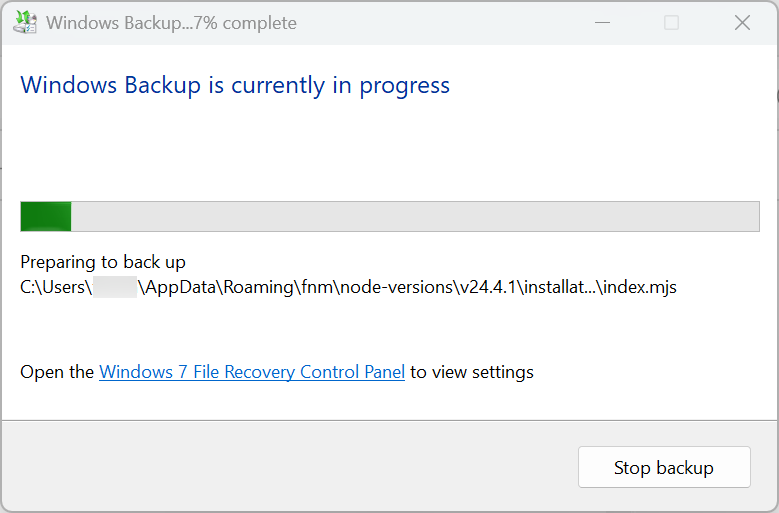

# 告别重装系统：我用 VHDX 差分链给 Windows 写了个“时光机”

GitHub 项目地址：[https://github.com/hamflx/layered-system](https://github.com/hamflx/layered-system)

## 前言：作为“工具党”的烦恼

作为一个开发者，我的电脑就是我的战场。为了开发某个项目，你安装了一堆特定的 SDK、运行时环境、数据库中间件；为了调试某个诡异的 bug，你修改了系统环境变量、注册表，甚至替换了系统 DLL。又或者，为了测试某个合作方发来的（可能不太干净的）软件，你不得不硬着头皮在主力机上运行它。

随着时间的推移，你的 C 盘变得越来越臃肿，右键菜单里塞满了乱七八糟的选项，系统开始莫名其妙地卡顿、蓝屏。

这时候，最彻底的解决办法就是重装系统。但是，重装系统意味着我要花一整天的时间重新安装驱动、配置开发环境、激活各种软件……这简直是噩梦！

你可能会问：“为什么不用 Windows 自带的备份还原？”

好吧，请看这张图：



那个长长的滚动条已经说明了一切。Windows 的还原点机制古老、笨重，而且经常莫名其妙地失效。更重要的是，它不支持“分支”——我想要的是像 Git 一样管理我的系统：

- **Master 分支**：干净的 Windows 基础环境。
- **Feature 分支 A**：安装了全套 Python 开发环境。
- **Feature 分支 B**：安装了全套 C++ 游戏开发环境。
- **Testing 分支**：专门用来测试各种不确定安全的软件，坏了直接删掉重开。

为了实现这个梦想，我开发了 **Layered System**。

## 核心原理：VHDX 差分链

Layered System 的核心在于利用 Windows 原生的 **VHDX（虚拟硬盘）** 技术，特别是它的 **差分（Differencing）** 能力。

### 什么是差分盘？

简单来说，你可以创建一个基础的 VHDX 镜像（母盘），里面安装好干净的 Windows 系统。然后，你可以基于这个母盘创建一个“差分盘”（子盘）。

- **母盘**：只读。
- **子盘**：记录所有的新增和修改数据。

当你从子盘启动系统时，Windows 会读取母盘的数据，并将新的写入操作保存到子盘中。这意味着，子盘的大小通常非常小，而且创建速度极快（秒级）。

### 像 Git 一样管理系统

通过这种机制，我们可以构建一个树状的系统结构：

```text
[Base.vhdx] (干净的 Windows 10)
    ├── [Python-Env.vhdx] (安装了 Python, VSCode)
    │       ├── [Project-A.vhdx] (项目 A 的特定配置)
    │       └── [Test-Lib.vhdx] (测试某个新库)
    └── [Game-Dev.vhdx] (安装了 Unity, 3ds Max)
```

如果我在 `Test-Lib.vhdx` 里把系统搞崩了，我只需要把这个文件删掉，重新从 `Python-Env.vhdx` 创建一个新的子盘即可。整个过程只需要几秒钟，不需要重装系统，不需要 Ghost 还原。

## Layered System 是什么？

Layered System 是一个开源的桌面应用，专门用来管理这种 VHDX 差分链。

### 技术栈

- **前端**：React + TypeScript + Tailwind CSS（提供现代化的 UI）。
- **后端**：Rust（Tauri 框架）。
- **底层**：直接调用 Windows 原生命令 (`diskpart`, `dism`, `bcdboot`, `bcdedit`)。

### 主要功能

1. **可视化树状管理**：清晰地展示你的系统层级结构。
2. **一键创建节点**：
    - **初始盘**：选择官方 ISO 提取的 WIM/ESD 镜像，自动创建 GPT 分区、EFI 引导，制作纯净母盘。
    - **差分盘**：选择任意父节点，瞬间创建子系统。
3. **秒级切换**：选中任意节点，点击“设为下次启动并重启”，工具会自动修改 BCD（启动配置数据），重启后直接进入该系统。
4. **便携设计**：除了 BCD 引导项需要写入本机主板，所有的 VHDX 文件都保存在你指定的目录中。

## 它是如何工作的？

当你点击“创建初始盘”时，Rust 后端会忙活起来：

1. **Diskpart**：创建一个物理隔离的 VHDX 文件，分区并格式化。
2. **DISM**：将纯净的 Windows 镜像（WIM）释放到这个 VHDX 中。
3. **Bcdboot**：向这个 VHDX 写入引导文件，使其可启动。

当你创建“差分盘”时：

1. **Diskpart**：创建一个新的 VHDX，并指定 `parent` 参数指向父盘。
2. **Bcdboot**：再次写入引导信息，让 Windows 启动管理器识别这个新盘。

整个过程不需要 Hyper-V，不需要虚拟机软件，跑的是**原生硬件性能**。

## 为什么选择 Layered System？

| 特性 | 虚拟机 (VMware/VirtualBox) | 传统备份 (Ghost/Backup) | Layered System |
| :--- | :--- | :--- | :--- |
| **性能** | 虚拟化，有损耗 | 原生 | **原生** |
| **隔离性** | 强 | 无 | 中 (共享硬件) |
| **回滚速度** | 快 (快照) | 慢 (全盘恢复) | **极快 (切换文件)** |
| **空间占用** | 大 (完整系统) | 大 (完整镜像) | **小 (仅增量)** |
| **分支管理** | 支持 | 不支持 | **完美支持** |

## 结语

Layered System 并不是要取代虚拟机，它更适合那些需要**原生性能**且需要**频繁回滚/切换环境**的场景。比如驱动开发、系统软件测试，或者仅仅是你像我一样，有“系统洁癖”但又不得不安装大量软件。

目前项目处于早期开发阶段（Alpha），我们已经完成了核心的 VHDX 管理、BCD 引导切换和基础的 UI 界面。

如果你也对这种“系统时光机”感兴趣，欢迎关注我们的项目！让我们一起告别“重装系统”的痛苦循环。

---

*注：本项目涉及修改系统引导记录 (BCD)，虽然我们做了很多安全检查，但建议在尝试前备份重要数据。*
